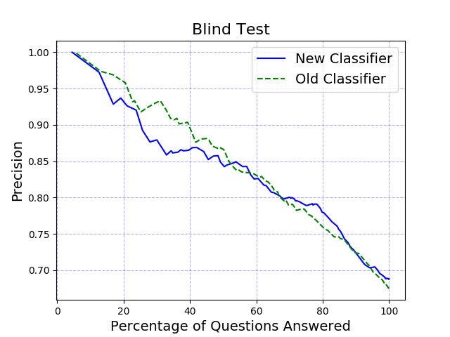

# Blind Set Testing
## Story
Given a training set of Watson Assistant utterances mapped to intents with optional entities set, the user wants to test its performance by using a blind set.

## Workflow
Unlike k-fold process, no separate folds will be created. Only one workspace is going to be trained using all of the training set. After the testing, both the test output and the `previous_test_out` are fed into `createPrecisionCurve.py` for plotting curves.

Further, reports are generated for an [intent metrics summary](intent-metrics.md) and a [confusion matrix](confusion-matrix.md).  These include additional summaries and visualizations that help determine the strength and weaknesses of the training set.

## Input file
`config.ini` (fill in your `iam_apikey`, `url`, and `workspace_id` at minimum. (Older instances use a url like "https://gateway-wdc.watsonplatform.net/assistant/api")

```
[ASSISTANT CREDENTIALS]
iam_apikey = <wa iam apikey>
url = https://gateway-wdc.watsonplatform.net/assistant/api
version=2019-02-28

[DEFAULT]
mode = blind
workspace_id = 01234567-9ABC-DEF0-1234-56789ABCDEF0

; Provide when comparing to a previous blind test result
;previous_blind_out = ./data/previous_blind_out.csv

; optional - defaults shown here
;output_directory = ./data
;test_input_file = ./data/input.csv
;blind_figure_title = "<igure name"
;test_output_path = ./data/blind-out.csv
;out_figure_path= ./data/blind.png
;keep_workspace_after_test = no
```

`test_input_file` - Blind test set. Defaults `./data/input.csv`. Should have columns `utterance` and `golden intent`

`previous_blind_out` - (Optional) Test output from previous blind test result.


## Sample output


## Additional options
[Partial credit scoring](partial-credit.md) may be configured when intents are intentionally similar or overlapping, especially in the case of multi-intent statements.
