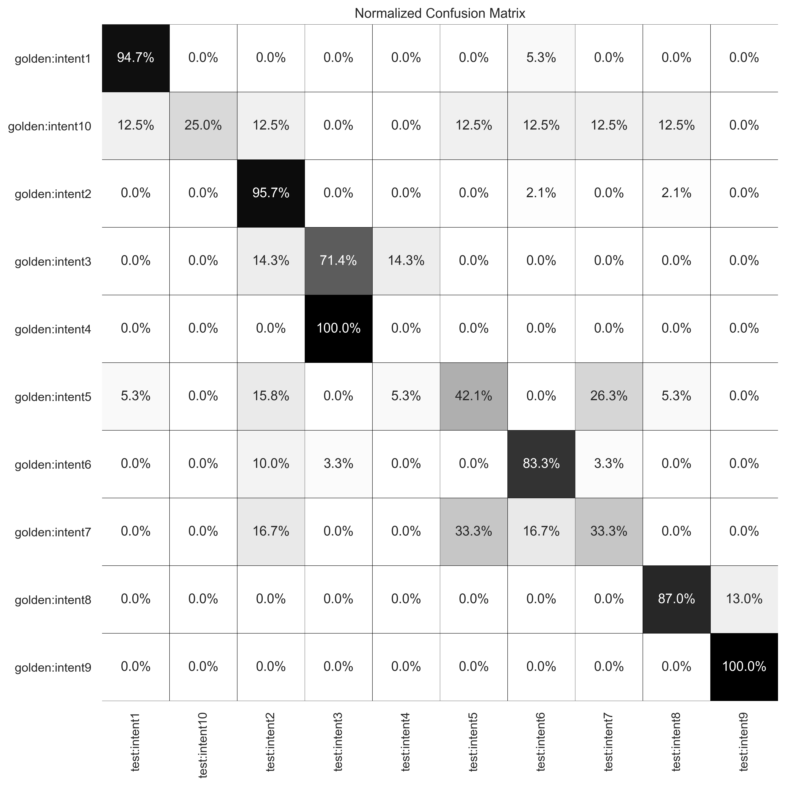

# Confusion Matrix summary

## Story
Given an existing set of intent testing results, the user wants to build a confusion matrix between the golden and predicted intents.  From this performance the user can decide which intents need further training or revision.

## Workflow
There are two starting possibilities:

1) The user has run existing [k-folds](kfold.md) or [blind](blind.md) test which creates a summary .csv file

2) The user has a separate analysis which creates a .csv file with "golden" and "predicted" columns

User executes `confusionmatrix.py` providing an input filename and output filename.  If using workflow 2, the user provides the names of the golden and predicted column header names with `-g` and `-t` respectively.
The summary is written to the output filename.

## Prerequisite
User must have an input .csv file containing at least two column headers representing "golden" and "predicted" filenames.

## Invocation
Workflow #1
Assuming input file at `data/test-out.csv` created by other tools in this repository and writing to `test-out-matrix.csv'.

```
python3 utils/confusionmatrix.py -i data/test-out.csv -o data/test-out-matrix.csv
```

Workflow #2
Assuming input file at `data/golden_vs_predicted.csv` and writing to `data/golden_vs_predicted_metrics.csv`.  Since a different tool has created the input file we need to specify the names of the golden and predicted column headers which otherwise default to "golden intent" and "predicted intent".


`data/golden_vs_predicted.csv` example contents

```
"predicted","golden"
"intent1","intent1"
"intent1","intent2"
"intent1","intent2"
"intent2","intent2"
"intent2","intent2"
```

Invoke via:
```
python3 utils/confusionmatrix.py -i data/golden_vs_predicted.csv -o data/golden_vs_predicted-matrix.csv -t "predicted" -g "golden"
```

## Sample output
```
"","test:intent1","test:intent2"
"golden:intent1","1","0"
"golden:intent2","2","2"
```

This mode also generates the confusion matrix as a heatmap where:
* COLOR of box relates to number of samples for that intent

An ideal confusion matrix has black boxes on the diagonal and no other colors.  For improvement focus on the darkest boxes off of the main diagonal.

Using a [larger example file](../resources/example-kfold-test-out-union.csv) we get the following heatmap:


