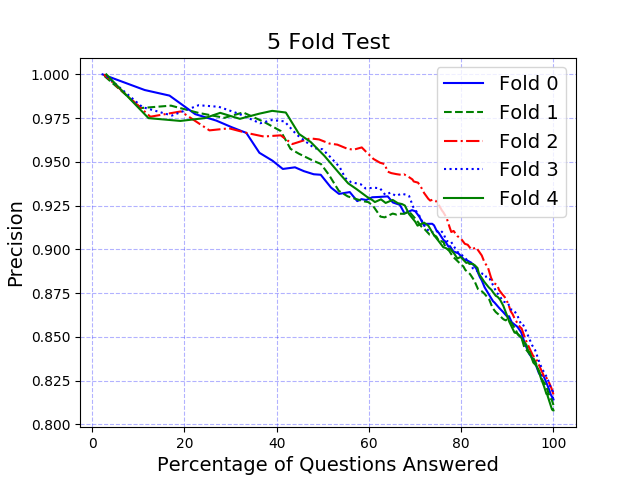

# K Fold Cross Validation Use Case

## Story
Given an existing training set of utterances mapped to intents, the user wants to perform a 5 fold cross validation and visualize the precision at different percentage of questions being answered.

## Workflow
By starting `run.py` with provided `config.ini`, `createTestTrainFolds.py` will create 5 folders with each fold's training and testing data under the `temporary_file_directory`. Then, `trainConversation.py` is going to training 5 workspaces and save the workspace infomation under the folds' folders. `testConversation.py` will be invoked right after the previous step is completed and save the test output into corresponding fold folders. Finally, the `createPrecisionCurve.py` will read the test outputs and save to `out_figure_path`.

Further, reports are generated for an [intent metrics summary](intent-metrics.md) and a [confusion matrix](confusion-matrix.md).  These include additional summaries and visualizations that help determine the strength and weaknesses of the training set.

## Prerequisite
User's workspace must allow to create 5 more workspaces. For 'lite' plans, use 3 folds instead (`fold_num=3`)

## Input file
`config.ini` (fill in your `iam_apikey`, `url`, and `workspace_id` at minimum. (Older instances use a url like "https://gateway-wdc.watsonplatform.net/assistant/api")

```
[ASSISTANT CREDENTIALS]
iam_apikey = <wa iam apikey>
url = https://api.us-east.assistant.watson.cloud.ibm.com
version=2019-02-28

[DEFAULT]
mode = kfold
workspace_id = 01234567-9ABC-DEF0-1234-56789ABCDEF0

; optional - defaults shown here
;train file used by NLC only - defaults to <temporary_file_directory>/intent-train.csv
;train_input_file = ./data/intent-train.csv
;fold_num = 5
;output_directory = ./data
;test_output_path = ./data/kfold-out.csv
;out_figure_path= ./data/figure.png
;conf_thres = 0.2
```

## Sample output


## Troubleshooting
The most common error running a k-folds test is running out of available workspaces, particularly if you are on a Lite plan which limits you to 5 workspaces.  The k-folds test creates `fold_num` workspaces.

If you run out of workspaces, delete any unused workspaces and reduce the `fold_num` parameter to a smaller value (ex: `fold_num=3`).

## Background on k-fold Testing
Performing a k-fold cross-validation on your training set is a technique that can be used to find opportunities to further improve your training data by finding confusing training.   This tool helps you perform a cross-validation and use it to generate a confusion analysis.

It is important not to misuse the score produced from a cross-validation.  A cross-validation score is a metric that measures ground truth consistency – i.e., how much confusion there is in your ground truth.  It is not a predictor of how well your ground truth will do when applied to real users.  As a simple illustration of this:  you can improve a cross validation score by removing all training that is difficult to handle, leaving only training that is very easy to classify into the correct intent.  This may produce a high cross-validation score such as 95%, but will perform very badly when applied to real customer utterances.

Thus cross-validation should only be used for identifying opportunities for improving the consistency in the ground truth.   For a pre-deploy metric of overall quality, a properly created and maintained test set must be used.

## Additional options
[Partial credit scoring](partial-credit.md) may be configured when intents are intentionally similar or overlapping, especially in the case of multi-intent statements.
