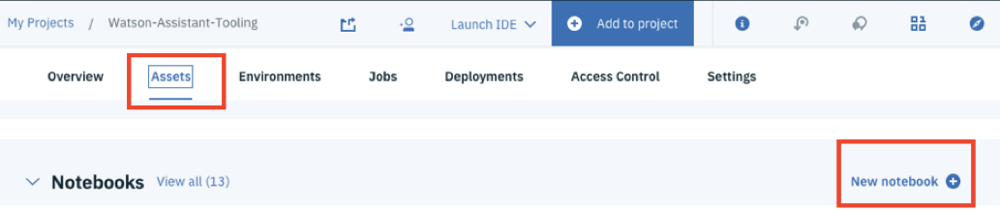
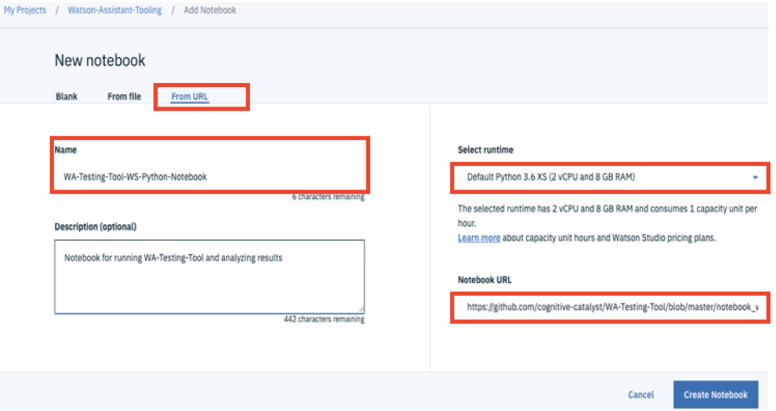
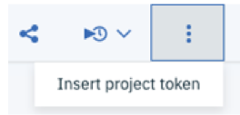
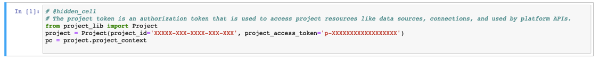
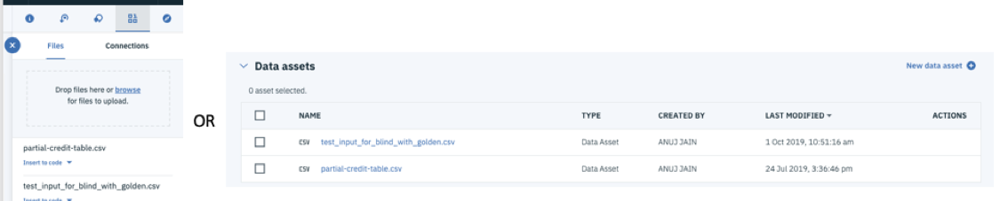

# Python Notebook for using WA-Testing-Tool
## - Getting Started -

This Notebook is a 'wrapper' that enables you to the run the WA-Testing Tool on IBM Watson Studio. 

---
**STEP 1.**	Login to the Watson Studio project you want to use for this Notebook. If you don’t have a Watson Studio project first create a new project in your account. You can use this link:
https://dataplatform.cloud.ibm.com/projects/create-project

---
**STEP 2.**	The Notebook uses Watson Studio project token. In a newly created project or if your existing Watson Studio project does not already have project token setup, make sure to set that up first. 

Here are the steps:

Go to the “Settings” tab of your project and scroll to “Access tokens” and create an access token by clicking on “New token”. Provide a name eg – “For-WA-Tooling” give “Editor” access permissions.

(Complete instructions https://dataplatform.cloud.ibm.com/docs/content/wsj/analyze-data/token.html)
 

---
**STEP 3.**	Navigate to “Assets” of your Watson Studio project and import the Notebook by clicking “New Notebook”

 

---
**STEP 4.**	Select “From URL” option.

Provide a “Name” for the Notebook. For runtime, at a minimum select “Default Python3.6 XS” .

Enter the "Notebook URL". Use the github repository URL below:

Master URL: 
(https://github.com/cognitive-catalyst/WA-Testing-Tool/blob/master/notebook_ws/WA-Testing-Tool-WS-Python-Notebook.ipynb) 

Dev URL (use this for the dev branch): 
(https://github.com/cognitive-catalyst/WA-Testing-Tool/blob/87_notebook_ws/notebook_ws/WA-Testing-Tool-WS-Python-Notebook.ipynb)

Create the Notebook.

 

---
**STEP 5.**	Navigate to “Assets” >> “Notebooks” for your project and Launch the new Notebook in Edit mode. 

---
**STEP 6.**	Once launched, the first step is to add the project token to the Notebook cell. This is needed to enable the files to be shared with the project environment securely. 

To add the project token to the Notebook:

> 6.1.	Click on the three vertical dots in the top menu bar and then "Insert project Token".
 
 

> 6.2.	A new project token for your project should appear in the first cell.

> 6.3.	Delete the example project token cell by selecting/highlighting it, then Edit > Delete Cells

> 6.4.	The project token is an authorization token that is used to access project resources like data sources, connections, and used by platform APIs.

> 6.5.	Make sure to "Run" the cell with your token to initialize the project token into variables.
  Example of the first cell (project token cell)
  

Once the project token cell is added make sure to ‘run’ it to initialize the variables.

---
**STEP 7.**	Follow the instructions provided in the Notebook.

In Section 1, the cells are for setting up the environment and initializing the variables. This is needed only the first time. Once you get to Section 2 you can start configuring the test parameters and running the test. 

---
**STEP 8.**	In Section 2, to add an input file (for example input for blind and standard tests.) simply drag-drop on the Data Files from the Notebook page, or you can add the file to the directly to the project Assets.

 
---
**STEP 9.**	Section 3 is for analyzing the results of your tests. Feel free to extend the analysis based on your needs and using the output files generated from the tests.

---
Thank you!
