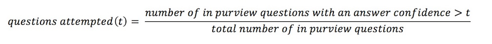
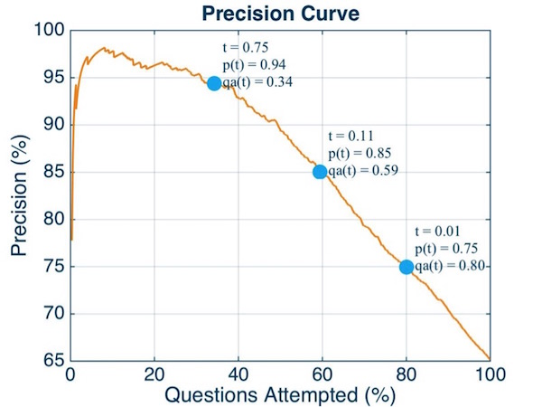

# Precision Curves

A precision curve can answer the following questions, given a list of utterances that are passed to Watson Assistant:

  1. “If Watson Assitant responds to 80% of the utterances that are posed to it, what percent of responses are correct?”
  2. “If I set the confidence threshold at 75% what percent of utterances in my test set will Watson Assintant respond to, and with what accuracy?”
  3. “If Watson answers 85% of the utterances it attempts to respond to correctly, what percentage of utterances did it attempt, and what is the confidence threshold set at?”

The idea of this analysis is to find a point where the confidence threshold is giving your chat bot the desired behavior. 
In a good chat bot design, there is a threshold of intent recognition, if the utterance passes below that threshold the chat 
bot will communicate back to the end user that it didn't understand the utterance as stated instead of responding erroneously. 
This behavior will build trust between the end user and the digital assistant.

As the confidence of the intent classification increases, so too should the accuracy of the intent classification.  This will be
visible in the precision graph as a negative slope.

The precise definition of precision for a given data set at a given confidence threshold, _t_ (or also reffered to as  _tau_), is:

And, the number of questions attempted is the formula:

Every value of _t_ will produce exactly one point on the precision curve.

A note on nomenclature: "total number of in purview questions" is equivalent to "number of utterances in the test set", 
and "number of correct answers" is equivalent to "number of correct responses".  This documentation was originally written for
a Watson Assistant that only answer questions, but the analysis for a generic Watson Assitant is calculated the same way.

Let's look at an example:

Now, let us use the Precision Curve above to answer our three questions from above:

  1. The number of utterances attempted is the x-axis of the plot, so examining where the line crosses 80%, we find that 75% of the attempted utterances answered are responded to correctly at this point.  The threshold confidence at this point is 0.01, as indicated by the annotated blue dot.
  2. If the confidence is set at 75% (t = 0.75), then this Watson system will only attempt to answer 34% of the utterances, but of that 34% of utterances, it responds to 94% of them correctly.
  3. When 85% of the attempted utterance responses are correct, that corresponds to the y-axis being 85%, so examining the corresponding point on the x-axis we find that this point is reached when we attempt 59% of the utterances, and the confidence threshold set at 0.11 (11%). 

For this instance, the administrator choose to use the operating threshold of 0.01, giving a precision of 75%.

This graph is given for informational purposes only, and is not meant to be indicative of how your Watson Assistant will peform on your data.

